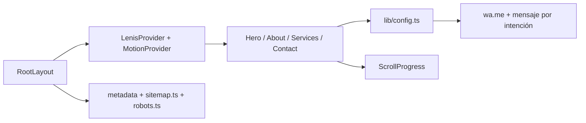

<div align="center">


# Ángela Sophia — Psicología

Landing editorial para el consultorio de psicología de Ángela Sophia en Pereira, Risaralda.

[](https://nextjs.org/)
[](https://react.dev/)
[](https://www.typescriptlang.org/)
[](https://tailwindcss.com/)
[](https://gsap.com/)

<br />

[Stack](#stack) · [Funcionamiento](#funcionamiento) · [Desarrollo](#desarrollo-local) · [Rutas](#rutas-principales) · [Deploy](#deploy)

</div>

---

Sitio de una sola página pensado como pieza editorial: hero con animación de entrada, scroll suave, secciones de servicios y contacto directo por WhatsApp con mensajes pre-armados según la intención del visitante.

## Stack

| Capa | Tecnología | Uso |
| --- | --- | --- |
| Framework | Next.js 16 App Router, React 19, TypeScript strict | Página única con metadata, sitemap y robots generados |
| UI | Tailwind CSS v4, componentes propios (`Button`, `Reveal`, `Marquee`, `SectionHeading`) | Maquetación editorial, tipografía y microcomponentes reutilizables |
| Animación | Framer Motion, GSAP | Entradas de hero, reveals por scroll y transiciones de sección |
| Scroll | Lenis | Scroll suave e indicador de progreso (`ScrollProgress`) |
| Analítica | `@next/third-parties` (Google Analytics) | Medición sin bloquear el hilo principal |
| Contacto | WhatsApp Web API (`wa.me`) | CTA directo con copy distinto por servicio |
| Calidad | ESLint 9 | Lint de código fuente |

## Funcionamiento



### Flujo de la página

1. `RootLayout` monta fuentes, JSON-LD de negocio local y providers globales de scroll/animación.
2. `Hero` presenta la propuesta de valor con animación de entrada escalonada.
3. `About` y `Services` explican el enfoque y los tipos de acompañamiento (individual, online, grupal).
4. Cada CTA de `Services`/`Contact` abre WhatsApp con un mensaje pre-armado según la intención (`whatsappMessages` en `lib/config.ts`).
5. `WhatsAppFloating` mantiene un acceso directo persistente al chat.

### Fuente única de verdad

Todo el copy operativo (teléfono, email, horarios, redes, mensajes de WhatsApp, links de navegación) vive en [`lib/config.ts`](lib/config.ts). Ningún componente hardcodea estos datos.

## Desarrollo local

### Requisitos

- Node.js 20 o superior.

### Instalación

```bash
npm install
npm run dev
```

La app queda disponible en `http://localhost:3000`.

### Comandos

```bash
npm run dev     # servidor de desarrollo
npm run build   # build de producción
npm run start   # sirve el build
npm run lint    # ESLint
```

### Smoke test

1. Ejecuta `npm run dev`.
2. Abre `http://localhost:3000` y verifica que el hero anime al cargar.
3. Haz scroll completo: confirma reveals de `About`, `Services` y `Contact`.
4. Haz clic en un CTA de servicio y confirma que abre WhatsApp con el mensaje correcto.
5. Revisa `/sitemap.xml` y `/robots.txt`.

## Rutas principales

| Ruta | Descripción |
| --- | --- |
| `/` | Página única con Hero, About, Services y Contact |
| `/sitemap.xml` | Sitemap generado desde `app/sitemap.ts` |
| `/robots.txt` | Reglas de robots generadas desde `app/robots.ts` |

## Estructura

```text
angela-sophia/
  app/
    layout.tsx           Metadata, fuentes, JSON-LD, providers globales
    page.tsx              Composición de secciones
    sitemap.ts            Sitemap dinámico
    robots.ts             Robots dinámico
  components/
    layout/                Navbar, Footer
    sections/               Hero, About, Services, Contact
    ui/                     Button, Reveal, Marquee, SectionHeading, WhatsApp CTAs
  providers/                LenisProvider, MotionProvider
  lib/                      config.ts, motion.ts, scroll.ts, whatsapp.ts
  public/
    assets/                 favicon, imagen de perfil para OG/Twitter
    images/, video/         media del sitio
```

## Convenciones

- App Router vive en `app/`; el sitio es de una sola ruta.
- Todo el copy visible está en español.
- Datos de contacto, redes y mensajes de WhatsApp viven únicamente en `lib/config.ts`.
- Componentes de sección en `components/sections/`, UI reutilizable en `components/ui/`.
- Animaciones de entrada usan Framer Motion; scroll-driven usa GSAP + Lenis.

## Deploy

### Web en Vercel

1. Importa el repo en Vercel.
2. Verifica que `site.domain` en `lib/config.ts` coincida con el dominio de producción (se usa para `metadataBase`, sitemap y JSON-LD).
3. Ejecuta deploy. Vercel detecta Next.js automáticamente.

## Licencia

Sin licencia pública definida.
